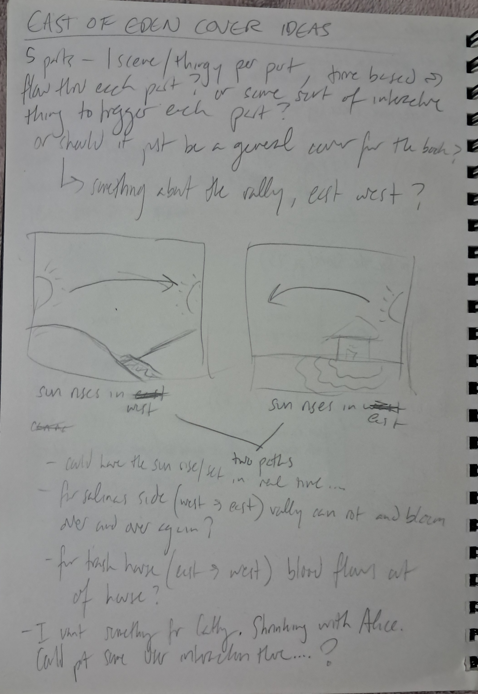
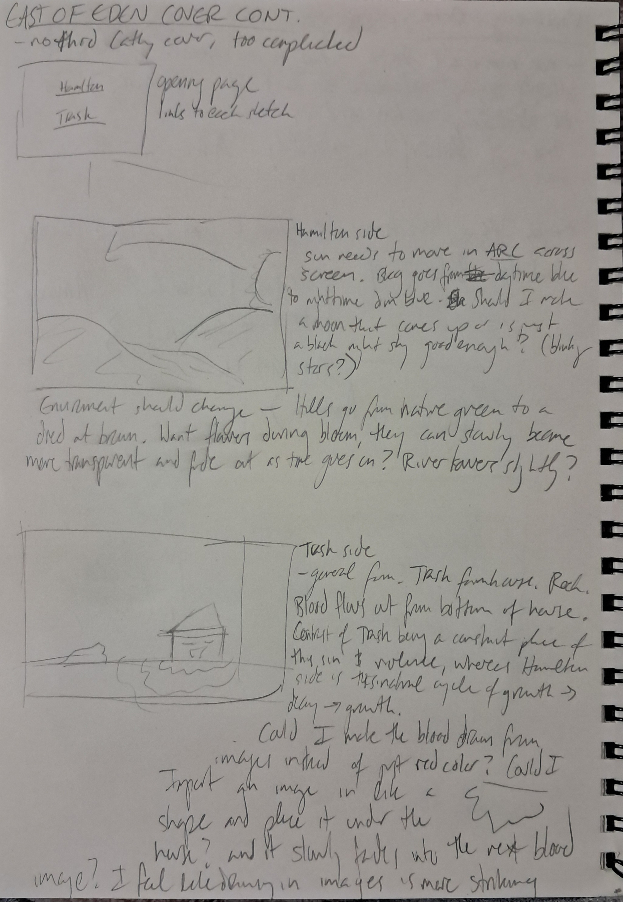

# Project Proposal

I will be creating a cover for East of Eden by John Steinbeck, a book that I have loved for a long time and written a lot about in the past 7 years. It's somewhat of a retelling of the Cain and Abel story, set across two generations of a family, the Trasks. The Trasks' story is interwoven with the Hamiltons, who the narrator is descended from. The book is somewhat hard to summarize, as it covers a lot of material, time, and many characters, but the essence of the book is about the responsibility one has over their own life, and man's ability to choose to overcome sin and not be defined by the sins of his parents. 

My idea for the cover is two 'scenes' that would represent each family in the book, the Hamiltons and the Trasks. One would be the Salinas Valley and its cycle of decay and growth. It's an important location in the book and represents, in some readings, the idea that life continues to grow and change around despite the choices you make. The other would be the Trask farmhouse with blood slowly leaking out of the bottom of it, representing both the conflict between Charles and Adam Trask and their introduction to Cathy Ames. I would like to be able to explain the details of these choices but the novel is really too dense to put succinctly (if you haven't read it, I would highly recommend it).

So far, my idea is for time-based "scenes." I would like a sun rising and setting in (somewhat) real time in each one: rising in the west and setting in the east for the Hamiltons and rising in the east and setting in the west for the Trasks. Along with the sun rising/setting in each, I would like something about the scene to change over time. As previously mentioned, I would like the hill and valley scenery on the Hamilton scene to decay and bloom over and over again, and on the Trask scene, for blood to seep and recede from the bottom of the farmhouse. Both of these will definitely involve some working with transparency, and for the Trask scene in particular, I would like to figure out a way to kind of use images as "textures" for a shape, like a physical collage, where the blood seeping out from the farmhouse would actually be many red-based images set into specific shapes fading into the next image (if that makes sense).

If I have the time, I would like to incorporate some interactivity into the scenes, but I'm not sure what those could/would be yet.

With these designs, I'll be trying to make more elaborate drawings and sceneries, building on the fundamental shape drawings we did in the first couple weeks of class to create more sophisticated drawings (hopefully), and the time-based aspect of the day/night cycle will inevitably incorporate what we've done past that.

My brainstorming sketches:





# Pseudocode

For this portion, I set up a moving sun animation that is mapped to the current time of day, i.e. so that at 12pm, the sun should be roughly in the middle of the screen, and at 6pm the sun is nearing the end of the screen. Originally, I couldn't figure out how to set the sun's movement to the actual time of day, and so I instead just animated it to move across the screen over the length of a day using `millis()`:
```
let aDay = millis() % 86400000
let xpos = map(aDay, 21600000, 72000000, -50, width + 50);
fill(255,199,0);
ellipse(xpos, 300, 100);
```
However, I realized that I could just convert the `hour()` and `minute()` functions into seconds, and add these together with `seconds()` and map the `xpos` variable against the seconds elapsed in real time. 

I then added a sky gradient using an `if()` statement for the background color, where between midnight and 5am, the sky is dark blue, between 5am and 6am, it slowly turns from dark blue to sky blue, between 7pm and 8pm it turns from sky blue to dark blue, and between 8pm and midnight, it's dark blue again. I'm fairly sure this works, but I'd like to check it periodically between 6pm and 9pm to make sure the gradient functions properly.

On the Trask page, I sketched out where the ground is, a basic house shape, and the rock. I also added a few images that I may use as the shape textures.


TO-DO:
1. Ideally, figure out how to make the sun move in an arc instead of a straight line across the screen, although I think that may end up being one of the harder things to figure out.

2. On the Hamilton side, I need to draw the hills and the river.

3. On the Trask side, draw a pool of blood coming out from under the rock, and animate so the pool gets bigger (and then recedes?).

4. For both sides, figure out how to mask the shapes with images, and then how to transition between images. I'm imagining that one image can increasingly become more transparent as the second image becomes less transparent, so that the change between them isn't a single cut? 

5. If time allows, perhaps put some nice blinking stars in the night sky.

6. Make the intro html page look nicer.


# Final Coding

In the final stages of the project, I did a lot with getting images and animations working. I realized that for rectangular shapes, masking wasn't really necessary, as I could just resize the image to where I wanted it. I figured out masking for the house roof, the hills, and the pools of blood. In my original code I had made a rock shape with lines and curves, and while we were shown how to make these shape functions into proper shape objects by using vertices, I wasn't sure how to make that work when curves were involved, and eventually I decided to simply use a transparent image of a rock instead, since I liked the way that looked better.

Since the hills were less precise shapes than the rock was, I made the hill masks by creating the shape of the hills in my image test sketch with ellipses and triangles, and turning them into transparent masks. For both the hills and the pools of blood, it took a lot of fiddling around to get the images in the proper placement and resolution that I wanted. Eventually I realized the easiest way to do this was to place the image where I wanted its final spot to be in my image test sketch, and save the entire page as an image, since that way I wouldn't have to deal with resizing the image and mask in the actual sketch.

Once I found out about `tint()`, making the hill and blood animations was much easier than I thought it would be, and the hardest part was mostly figuring out how to properly time everything. As of writing this, the hill animation moves over the course of an hour, moving from full bloom to grass to dried hills, then back to bloom. By mapping 0 to 255 (and vice versa) to the `millis()` count and using that result as a variable in `tint()`, I was able to make the images fade into each other during the transition between stages. 

I did the same concept for the blood animation, although I wanted that one to move faster, so I have it staged over the course of 1 minute. I also decided I wanted to make it so that the blood animation is only triggered once the user clicks the page. To me, this is a way of representing one of the main themes of the book, which is the contrast between the unchangeable natural flow of the world and man's ability to control his actions and life. In the book, it's exactly *because* life continues moving on no matter what we do that makes it matter so much that we take responsibility for own actions. In this way, the hills on the Hamilton page continue their transition through the natural life cycle of the valley without user interference, but on the Trask page, the ability to enact or stop violence is up to the user. Figuring out how to make the animation rely on clicks was tricky, but I figured it out with help from the professor. 

Next, I used the feedback from the second midterm milestone to try and get the sun moving in an arc. I tested it out in my image test sketch with a shorter timeframe to see if the movement actually worked, which it does. There were some issues with the sun appearing before the actual "sunrise" time started, which I dealt with just by inserting
```
  if (daytime < 21600 || daytime > 72000) {
    x = 0;
    y = 0;
  }
```
into my code. I'm fairly sure the arc movement works on my larger day timeframe, but just for posterity, this was the original code for the sun movement in a straight line:
```
let xpos = map(daytime, 21600, 72000, width + 50, -50);
fill(255,199,0);
ellipse(xpos, 300, 100);
```

I also decided to add some blinking stars in the night sky, to look nice, which I did by just tweaking one of the exercises we did in an earlier class session.


FIX THE HTML WHAT PAGE IT OPENS ON

IF TIME ALLOWS:
make clouds? could make as a shape in function and then just a simple make them slowly float across sky, randomized y location randomized size? idk.

