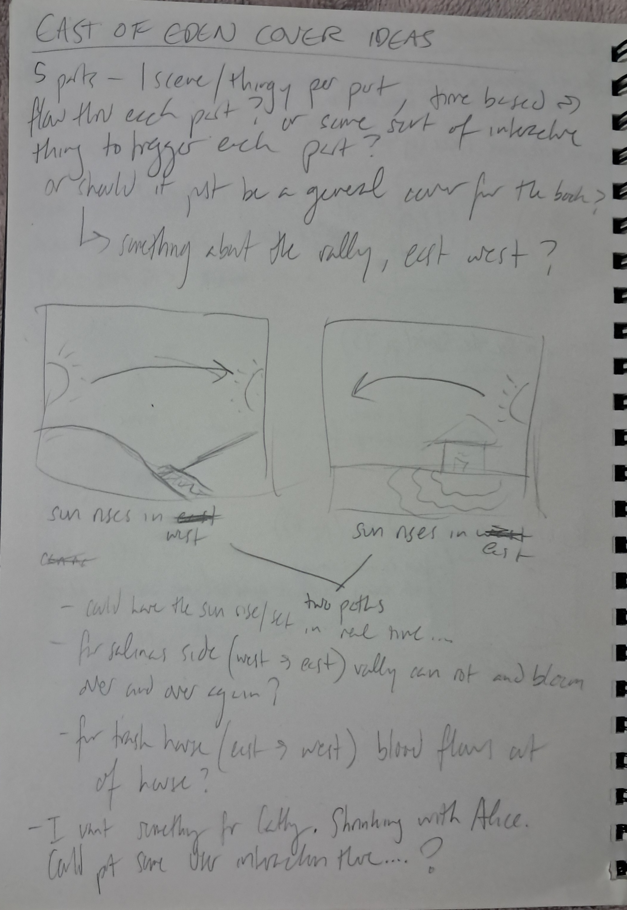
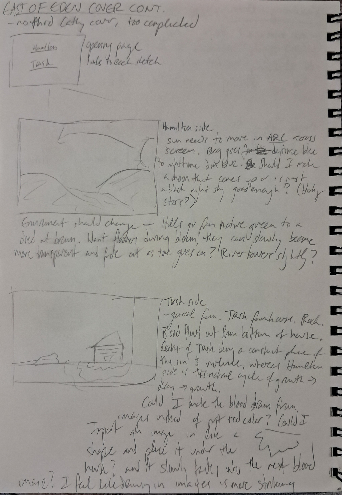

# Project Proposal

I will be creating a cover for East of Eden by John Steinbeck, a book that I have loved for a long time and written a lot about in the past 7 years. It's somewhat of a retelling of the Cain and Abel story, set across two generations of a family, the Trasks. The Trasks' story is interwoven with the Hamiltons, who the narrator is descended from. The book is somewhat hard to summarize, as it covers a lot of material, time, and many characters, but the essence of the book is about the responsibility one has over their own life, and man's ability to choose to overcome sin and not be defined by the sins of his parents. 

My idea for the cover is two 'scenes' that would represent each family in the book, the Hamiltons and the Trasks. One would be the Salinas Valley and its cycle of decay and growth. It's an important location in the book and represents, in some readings, the idea that life continues to grow and change around despite the choices you make. The other would be the Trask farmhouse with blood slowly leaking out of the bottom of it, representing both the conflict between Charles and Adam Trask and their introduction to Cathy Ames. I would like to be able to explain the details of these choices but the novel is really too dense to put succinctly (if you haven't read it, I would highly recommend it).

So far, my idea is for time-based "scenes." I would like a sun rising and setting in (somewhat) real time in each one: rising in the west and setting in the east for the Hamiltons and rising in the east and setting in the west for the Trasks. Along with the sun rising/setting in each, I would like something about the scene to change over time. As previously mentioned, I would like the hill and valley scenery on the Hamilton scene to decay and bloom over and over again, and on the Trask scene, for blood to seep and recede from the bottom of the farmhouse. Both of these will definitely involve some working with transparency, and for the Trask scene in particular, I would like to figure out a way to kind of use images as "textures" for a shape, like a physical collage, where the blood seeping out from the farmhouse would actually be many red-based images set into specific shapes fading into the next image (if that makes sense).

If I have the time, I would like to incorporate some interactivity into the scenes, but I'm not sure what those could/would be yet.

With these designs, I'll be trying to make more elaborate drawings and sceneries, building on the fundamental shape drawings we did in the first couple weeks of class to create more sophisticated drawings (hopefully), and the time-based aspect of the day/night cycle will inevitably incorporate what we've done past that.

My brainstorming sketches:

